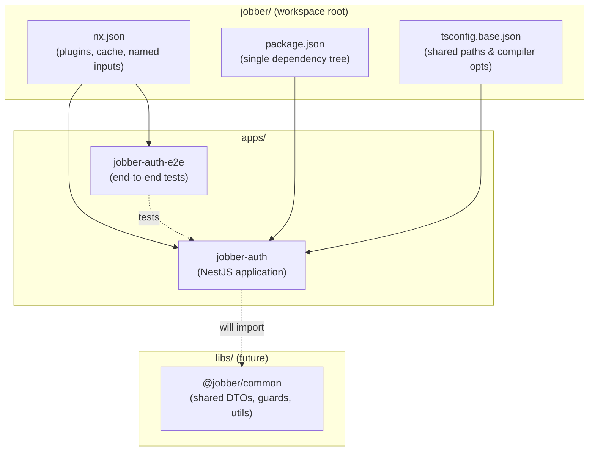
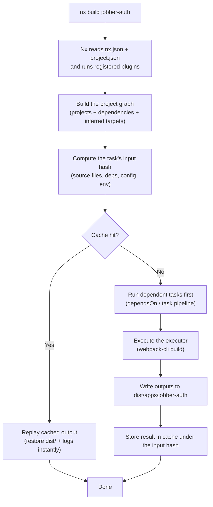
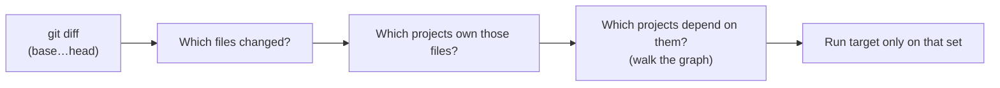
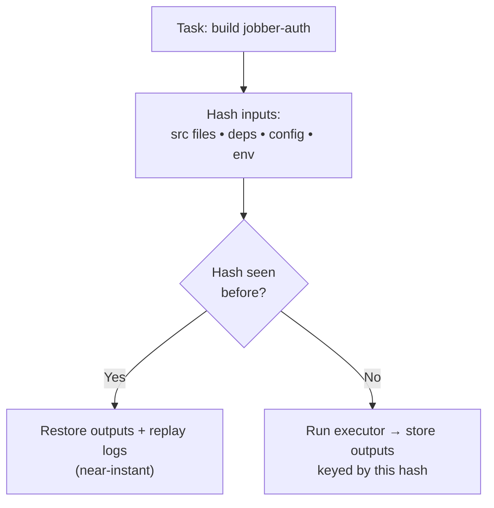
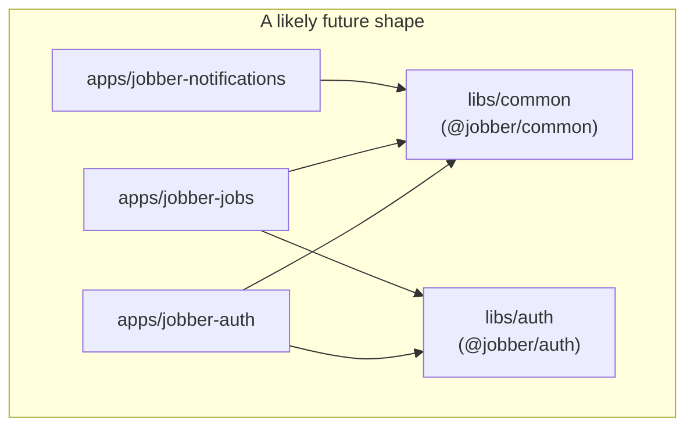
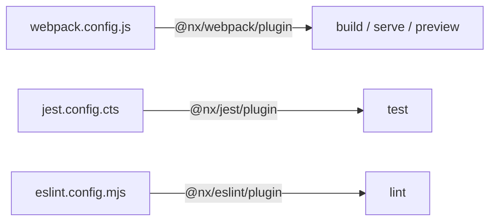

# Jobber — Nx Workspace Architecture

> A guide to how this Nx monorepo is structured, why Nx is used, and how to work with it day-to-day.

This workspace was bootstrapped with:

```bash
npx create-nx-workspace --preset nest --name jobber --appName jobber-auth
```

That single command produced an **integrated Nx monorepo** using the **NestJS preset**, with a first application named `jobber-auth` (and its companion e2e project `jobber-auth-e2e`).

---

## Table of Contents

1. [What is Nx?](#1-what-is-nx)
2. [Why use an Nx workspace?](#2-why-use-an-nx-workspace)
3. [High-level architecture](#3-high-level-architecture)
4. [This repository's structure](#4-this-repositorys-structure)
5. [Core concepts](#5-core-concepts)
6. [How a task runs (execution flow)](#6-how-a-task-runs-execution-flow)
7. [The project graph & affected commands](#7-the-project-graph--affected-commands)
8. [Caching — how Nx stays fast](#8-caching--how-nx-stays-fast)
9. [Apps vs. Libs (and where this repo goes next)](#9-apps-vs-libs-and-where-this-repo-goes-next)
10. [Useful Nx commands](#10-useful-nx-commands)
11. [Configuration files reference](#11-configuration-files-reference)
12. [Glossary](#12-glossary)

---

## 1. What is Nx?

**Nx** is a build system and monorepo toolkit. It sits _on top of_ your existing tools (webpack, Jest, ESLint, TypeScript, NestJS) and coordinates them intelligently. Nx does not replace webpack or Jest — it _orchestrates_ them.

Nx gives you three big capabilities:

| Capability        | What it means in practice                                                           |
| ----------------- | ----------------------------------------------------------------------------------- |
| **Understanding** | Nx builds a graph of every project and how they depend on each other.               |
| **Speed**         | Nx caches task results and only re-runs work that could actually have changed.      |
| **Consistency**   | Every project builds/tests/lints the same way through shared executors and plugins. |

A **monorepo** is a single git repository that holds multiple projects (apps and libraries). Nx makes a monorepo practical at scale by answering: _"Given a change, what is the minimum set of projects I must rebuild and retest?"_

---

## 2. Why use an Nx workspace?

For a backend like `jobber` — which will likely grow into multiple microservices (auth, jobs, notifications, billing, …) plus shared libraries — a monorepo with Nx buys you:

- **Code sharing without publishing** — shared DTOs, auth guards, and utilities live in `libs/` and are imported via TypeScript path aliases (e.g. `@jobber/common`). No `npm publish`, no version drift.
- **One dependency tree** — a single `package.json` and lockfile at the root. Every service uses the same version of NestJS, RxJS, etc. No "works on service A, breaks on service B."
- **Atomic changes** — a single PR/commit can change a shared library _and_ every service that consumes it. Reviewers see the full blast radius in one place.
- **Only rebuild what changed** — `nx affected` reruns tasks for just the projects touched by your diff, instead of the whole repo.
- **Computation caching** — if inputs haven't changed, Nx replays a previous result instantly (locally, and optionally across the team/CI via remote cache).
- **Consistent tooling** — build/test/lint behavior is defined once through Nx plugins, so every new service inherits it automatically.

**Integrated vs. package-based:** this workspace is an **integrated** monorepo (the NestJS preset default). Projects share root-level tooling config and use Nx executors/plugins, rather than each project carrying its own standalone build setup. This maximizes consistency and cache reuse.

---

## 3. High-level architecture



Everything flows from the three root config files. Nx reads them, discovers your projects, wires up their tasks, and runs them through the right tools.

---

## 4. This repository's structure

```
jobber/
├── nx.json                     # Nx config: plugins, caching, named inputs
├── package.json                # Single shared dependency tree for the whole repo
├── package-lock.json           # One lockfile for all projects
├── tsconfig.base.json          # Base TS config + path aliases shared by all projects
├── eslint.config.mjs           # Root ESLint flat config
├── jest.config.ts              # Root Jest config (aggregates project configs)
├── jest.preset.js              # Shared Jest preset
│
├── apps/
│   ├── jobber-auth/            # The NestJS auth service
│   │   ├── project.json        # Project's targets (build, serve, test, prune…)
│   │   ├── webpack.config.js   # Webpack build config (via @nx/webpack)
│   │   ├── jest.config.cts     # Project-level Jest config
│   │   ├── eslint.config.mjs   # Project-level ESLint config
│   │   ├── tsconfig.json       # Project TS config (references app + spec)
│   │   ├── tsconfig.app.json   # TS config for the app source
│   │   ├── tsconfig.spec.json  # TS config for tests
│   │   └── src/
│   │       ├── main.ts         # Nest bootstrap (listens on :3000, prefix /api)
│   │       ├── assets/         # Static assets copied into the build
│   │       └── app/
│   │           ├── app.module.ts
│   │           ├── app.controller.ts
│   │           ├── app.controller.spec.ts
│   │           ├── app.service.ts
│   │           └── app.service.spec.ts
│   │
│   └── jobber-auth-e2e/        # End-to-end test project for jobber-auth
│       ├── project.json
│       └── src/
│           ├── jobber-auth/jobber-auth.spec.ts
│           └── support/        # global-setup, global-teardown, test-setup
│
├── dist/                       # Build output (git-ignored)
└── .nx/                        # Local Nx cache & workspace metadata (git-ignored)
```

### The app itself (`apps/jobber-auth/src/main.ts`)

The Nest bootstrap is standard: it creates the app, sets a global `/api` prefix, and listens on `PORT` (default `3000`).

```ts
const app = await NestFactory.create(AppModule);
app.setGlobalPrefix('api'); // all routes served under /api
await app.listen(process.env.PORT || 3000);
// → http://localhost:3000/api
```

---

## 5. Core concepts

### Project

A unit Nx can act on. This repo has two: `jobber-auth` (an **application**) and `jobber-auth-e2e` (an application-type e2e project). Each has a `project.json`.

### Target (a.k.a. task)

A named operation on a project — `build`, `serve`, `test`, `lint`, `prune`. You run one with `nx <target> <project>`, e.g. `nx build jobber-auth`.

### Executor

The code that actually performs a target. In this repo:

- `build` uses `nx:run-commands` to invoke `webpack-cli build`.
- `serve` uses `@nx/js:node` to run the built output.
- `prune`, `prune-lockfile`, `copy-workspace-modules` use `@nx/js:*` executors to produce a lean, deployable `dist/` (useful for Docker images).

### Plugin

Plugins **infer** targets automatically so you don't hand-write them. From `nx.json`:

```jsonc
"plugins": [
  { "plugin": "@nx/webpack/plugin", "options": { "buildTargetName": "build", "serveTargetName": "serve", ... } },
  { "plugin": "@nx/eslint/plugin",  "options": { "targetName": "lint" } },
  { "plugin": "@nx/jest/plugin",    "options": { "targetName": "test" }, "exclude": ["apps/jobber-auth-e2e/**/*"] }
]
```

- `@nx/webpack/plugin` — sees `webpack.config.js` and gives the project `build`/`serve`/`preview` targets.
- `@nx/jest/plugin` — sees `jest.config.cts` and gives the project a `test` target.
- `@nx/eslint/plugin` — sees `eslint.config.mjs` and gives the project a `lint` target.

This is why `project.json` is short: most targets are _inferred_, and it only overrides the specifics (like the custom `build`/`serve`/`prune` pipeline).

### Named inputs

Defined in `nx.json`, these describe _what counts as an input_ to a task, which drives caching. The `production` input, for example, deliberately **excludes** test and config files so that changing a spec file doesn't invalidate a production build's cache:

```jsonc
"production": [
  "default",
  "!{projectRoot}/eslint.config.mjs",
  "!{projectRoot}/**/?(*.)+(spec|test).[jt]s?(x)?(.snap)",
  "!{projectRoot}/jest.config.[jt]s",
  ...
]
```

---

## 6. How a task runs (execution flow)

What happens when you run `nx build jobber-auth`:



The key idea: **Nx never runs work it can prove is unnecessary.** The input hash is a fingerprint of everything that could affect the output. Same fingerprint → same result → replay from cache.

### Task pipelines (`dependsOn`)

Targets can declare prerequisites. In this repo's `prune` pipeline:

```
prune ──▶ prune-lockfile ──▶ build
      └──▶ copy-workspace-modules ──▶ build
```

Asking for `prune` makes Nx run `build` first, then `prune-lockfile` and `copy-workspace-modules`, then the no-op `prune` that ties them together. You never manage this ordering by hand — Nx derives it from the graph.

---

## 7. The project graph & affected commands

Nx maintains a **project graph**: every project and the dependency edges between them (derived from your `import` statements and `tsconfig` path aliases).


Visualize it interactively:

```bash
nx graph
```

### Affected

On CI (and locally), you rarely want to rebuild everything. `nx affected` uses the graph plus your git diff to run tasks **only** for projects impacted by a change:

```bash
nx affected -t build test lint      # build/test/lint only what changed vs. base
nx affected -t test --base=main --head=HEAD
```



If you edit `@jobber/common`, both `jobber-auth` and `jobber-auth-e2e` become affected. If you edit only `jobber-auth`'s controller, `@jobber/common` is _not_ affected and its cached results stand.

---

## 8. Caching — how Nx stays fast

Nx computes a hash from a task's inputs (source, dependencies, relevant config, env vars, runtime versions). If that exact hash has been seen before, Nx **replays** the stored terminal output and restores the declared `outputs` — no real work runs.



- **Local cache** lives in `.nx/cache/` (git-ignored).
- **`outputs`** in each target (e.g. `dist/apps/jobber-auth`) tell Nx what to save and restore.
- **`namedInputs`** control what invalidates the cache — this is why changing a spec file won't bust a production build.
- **Remote cache (Nx Cloud)** can share the cache across teammates and CI so a build someone else already did is free for you. Not enabled here (`"analytics": false`, no Nx Cloud token), but it's a one-command add: `nx connect`.

Reset the cache if it ever gets into a bad state:

```bash
nx reset
```

---

## 9. Apps vs. Libs (and where this repo goes next)

|              | **Applications** (`apps/`)                       | **Libraries** (`libs/`)                     |
| ------------ | ------------------------------------------------ | ------------------------------------------- |
| Purpose      | Deployable, runnable things (your Nest services) | Reusable code consumed by apps/other libs   |
| Runnable?    | Yes (`nx serve`)                                 | No — imported, not run                      |
| Example here | `jobber-auth`                                    | _none yet_ — `@jobber/common` would go here |

Right now the repo has only an app. The natural evolution for `jobber` is to add shared libraries and more services. To add a shared NestJS library:

```bash
nx g @nx/nest:library common          # creates libs/common, wires @jobber/common path alias
```

Nx adds a path alias in `tsconfig.base.json` (`"@jobber/common": ["libs/common/src/index.ts"]`), and any service can then `import { ... } from '@jobber/common'`. The `paths` object in your `tsconfig.base.json` is currently empty (`"paths": {}`) — that's where these aliases will land.

To add another service later:

```bash
nx g @nx/nest:application jobber-jobs  # a second microservice under apps/
```



A change to `@jobber/common` then automatically marks all three services as _affected_ — Nx retests exactly them, nothing more.

---

## 10. Useful Nx commands

### Running targets

```bash
nx serve jobber-auth              # run the app in watch mode (dev) → http://localhost:3000/api
nx build jobber-auth             # production build into dist/apps/jobber-auth
nx build jobber-auth --configuration=development
nx test jobber-auth              # run this project's Jest unit tests
nx lint jobber-auth              # lint this project
nx e2e jobber-auth-e2e           # run the end-to-end tests
```

### Running across many projects

```bash
nx run-many -t build             # build every project that has a build target
nx run-many -t test lint         # test AND lint every project
nx run-many -t test -p jobber-auth jobber-auth-e2e   # only these projects
```

### Affected (change-aware — ideal for CI)

```bash
nx affected -t build test lint   # only projects impacted by your git diff
nx affected -t test --base=main  # compare against main
nx affected:graph                # visualize what's affected
```

### Understanding the workspace

```bash
nx graph                         # interactive project dependency graph in the browser
nx show projects                 # list all projects
nx show project jobber-auth      # show a project's targets, inferred config, and inputs
nx show project jobber-auth --web  # same, rendered in the browser
```

### Code generation (scaffolding)

```bash
nx g @nx/nest:application <name>       # new Nest service under apps/
nx g @nx/nest:library <name>           # new shared library under libs/
nx g @nx/nest:resource users --project=jobber-auth   # CRUD resource (module+controller+service)
nx g @nx/nest:controller auth --project=jobber-auth
nx g @nx/nest:service auth --project=jobber-auth
nx list                                # list installed plugins
nx list @nx/nest                       # list generators/executors a plugin provides
```

> Tip: add `--dry-run` to any `nx g` command to preview the files it will create/change without writing them.

### Maintenance & housekeeping

```bash
nx reset                         # clear the local cache & daemon (fix weird states)
nx migrate latest                # update Nx and plugins to the latest, writing migrations.json
nx migrate --run-migrations      # apply the migrations that `nx migrate latest` prepared
nx repair                        # fix workspace config after manual changes
nx report                        # print versions of Nx, plugins, node (great for bug reports)
nx daemon --start                # the background daemon that keeps the graph warm
```

### Passing flags through

```bash
nx build jobber-auth --verbose
nx test jobber-auth --watch      # Jest watch mode
nx test jobber-auth --coverage   # coverage report
nx test jobber-auth -t "AppController"   # run tests matching a name
```

---

## 11. Configuration files reference

| File                                | Role                                                                                                                           |
| ----------------------------------- | ------------------------------------------------------------------------------------------------------------------------------ |
| `nx.json`                           | Workspace-wide Nx config: registered **plugins**, **namedInputs** (cache inputs), analytics toggle. The brain of the monorepo. |
| `apps/*/project.json`               | Per-project **targets**, executors, options, and `dependsOn` pipelines. Overrides/augments what plugins infer.                 |
| `package.json`                      | The **single** dependency tree for the whole repo (integrated monorepo).                                                       |
| `package-lock.json`                 | One lockfile pinning versions for every project.                                                                               |
| `tsconfig.base.json`                | Base TS compiler options + **path aliases** (`paths`) shared by all projects. Where `@jobber/*` aliases live.                  |
| `apps/*/tsconfig*.json`             | Per-project TS configs (`tsconfig.app.json` for source, `tsconfig.spec.json` for tests) that extend the base.                  |
| `eslint.config.mjs`                 | Root ESLint flat config; projects extend it via their own `eslint.config.mjs`.                                                 |
| `jest.config.ts` / `jest.preset.js` | Root Jest aggregation and shared preset; each project has its own `jest.config.cts`.                                           |
| `apps/*/webpack.config.js`          | Webpack build config consumed by `@nx/webpack`.                                                                                |
| `.nx/`                              | Local cache & workspace metadata. **Git-ignored** — never commit.                                                              |
| `dist/`                             | Build output. **Git-ignored.**                                                                                                 |

### Where the `nx.json` plugins come from

Because these three plugins are registered, every project that has the matching config file automatically gets targets — no per-project boilerplate:



---

## 12. Glossary

- **Workspace** — the whole repo Nx manages (this `jobber/` directory).
- **Project** — an app or lib Nx can operate on.
- **Target / Task** — a named operation on a project (`build`, `test`, …).
- **Executor** — code that implements a target.
- **Generator** — code that scaffolds files (`nx g …`).
- **Plugin** — an Nx package that infers targets and provides executors/generators (`@nx/nest`, `@nx/webpack`, …).
- **Project graph** — the dependency graph across all projects.
- **Affected** — the subset of projects impacted by a git diff.
- **Named input** — a declared set of files/env that feed a task's cache hash.
- **Cache hit / replay** — reusing a prior task result because inputs are unchanged.
- **Integrated monorepo** — Nx-style repo with shared root tooling and executors (this repo), as opposed to a package-based one.

---

### Quick reference: the commands you'll use most

```bash
nx serve jobber-auth      # develop
nx test jobber-auth       # unit test
nx lint jobber-auth       # lint
nx build jobber-auth      # production build
nx affected -t test lint  # CI: only what changed
nx graph                  # see the dependency graph
nx g @nx/nest:library X   # add shared code
```
