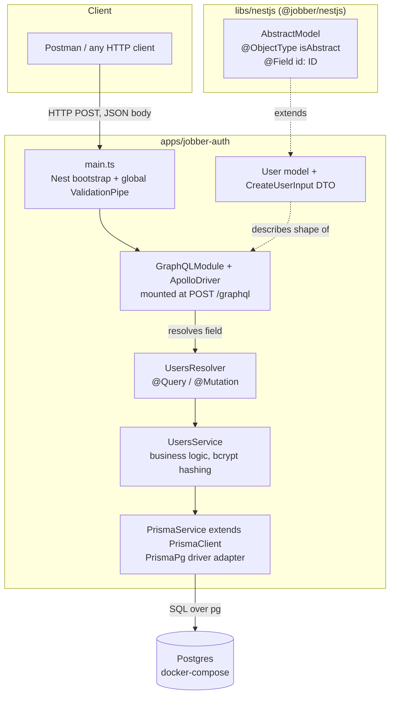
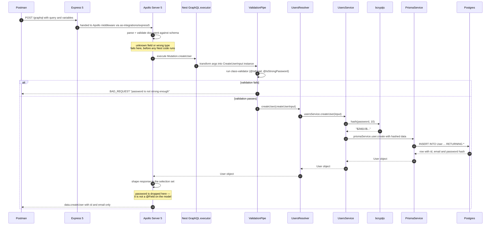
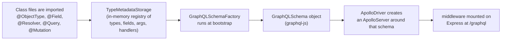

# GraphQL in the Jobber Monorepo — Architecture & Request Flow

> How a `createUser` mutation travels from Postman to Postgres and back: the code-first schema, the Nest layers, the shared `@jobber/nestjs` library, and what Nx does to tie an app and a lib together.

Related docs: [architecture.md](./architecture.md) · [prisma-6-to-7-migration.md](./prisma-6-to-7-migration.md) · [deployment.md](./deployment.md)

---

## Table of Contents

1. [TL;DR](#1-tldr)
2. [In layman's terms](#2-in-laymans-terms)
3. [The layers, and what each one owns](#3-the-layers-and-what-each-one-owns)
4. [End-to-end flow of a mutation](#4-end-to-end-flow-of-a-mutation)
5. [Code-first schema generation under the hood](#5-code-first-schema-generation-under-the-hood)
6. [How the app and the library interact (the Nx part)](#6-how-the-app-and-the-library-interact-the-nx-part)
7. [File-by-file walkthrough](#7-file-by-file-walkthrough)
8. [The resulting SDL](#8-the-resulting-sdl)
9. [Gotchas & troubleshooting](#9-gotchas--troubleshooting)

---

## 1. TL;DR

- The schema is **code-first**: there is no `.graphql` file to maintain. TypeScript classes decorated with `@ObjectType`, `@InputType`, `@Query` and `@Mutation` are the single source of truth, and `@nestjs/graphql` builds the schema **in memory at boot** because `app.module.ts` sets `autoSchemaFile: true`.
- The endpoint is **`http://localhost:3000/graphql`**, _not_ `/api/graphql`. `setGlobalPrefix('api')` does not apply to GraphQL unless you opt in with `useGlobalPrefix: true`.
- Three Nest layers do the work: **resolver** (transport/GraphQL), **service** (business rules), **PrismaService** (database). Each knows only about the layer directly beneath it.
- `libs/nestjs` is a **source-only shared library**, imported as `@jobber/nestjs`. It holds `AbstractModel`, the base GraphQL type carrying the `id` field, so every future microservice reuses one definition.
- Nx wires the app to the lib through a **TypeScript path mapping**, derives a project-graph edge from the actual `import`, and webpack inlines the lib's source into the app bundle. There is no separate build step for the lib.

---

## 2. In layman's terms

Think of the API as a **restaurant**.

| Restaurant                                                                   | Jobber                                        |
| ---------------------------------------------------------------------------- | --------------------------------------------- |
| The **menu** lists exactly what you may order and what you get back          | The **GraphQL schema**                        |
| The **waiter** takes the order, checks it makes sense, brings the plate back | The **resolver** (`UsersResolver`)            |
| The **chef** actually cooks, following the recipe                            | The **service** (`UsersService`)              |
| The **pantry** stores the ingredients                                        | **Postgres**, reached through `PrismaService` |
| The **recipe book** shared by every branch of the chain                      | The **`@jobber/nestjs` library**              |

The unusual part — and the thing worth internalising — is that **nobody writes the menu by hand.** You write the recipes and the waiter's job description in TypeScript, and the menu is printed automatically from them every time the restaurant opens. That is what "code-first" means. Add a `@Field()` to a class and the menu grows; delete it and the menu shrinks. The menu can never drift out of sync with the kitchen, because it is _derived_ from the kitchen.

The other idea is the **shared recipe book**. Every entity in this system will need an `id`. Rather than writing that into `User`, then again into `Job`, then again into `Product`, it is written once in `libs/nestjs` and every app reads from that one copy. Nx is the filing system that makes "read from that one copy" work across separate applications in the same repository.

---

## 3. The layers, and what each one owns



Each layer has exactly one reason to change:

| Layer                 | File                          | Owns                                                             | Deliberately knows nothing about |
| --------------------- | ----------------------------- | ---------------------------------------------------------------- | -------------------------------- |
| **Transport**         | `users.resolver.ts`           | Which operations exist, their argument names, their return types | SQL, hashing, Prisma             |
| **Domain**            | `users.service.ts`            | What "create a user" _means_ — hash the password, then persist   | HTTP, GraphQL, resolvers         |
| **Persistence**       | `prisma.service.ts`           | Connecting to Postgres and issuing queries                       | Users specifically               |
| **Contract**          | `user.model.ts`, `*.input.ts` | What the outside world may send and see                          | How anything is stored           |
| **Shared primitives** | `libs/nestjs`                 | Cross-service building blocks (`AbstractModel`)                  | Any single application           |

The payoff is concrete: `UsersService` has no GraphQL imports, so the same service can later be called from a gRPC or message-queue entry point without modification.

---

## 4. End-to-end flow of a mutation

This is the actual path of the `createUser` call you ran from Postman.



Two moments in that diagram deserve emphasis.

**Validation happens twice, at different levels.** Apollo validates _structurally_ — does `CreateUserInput` have a `password` field, is it a `String` — using the schema alone. Then Nest's `ValidationPipe` validates _semantically_ — is the email shaped like an email, is the password strong enough — using the `class-validator` decorators. The first check needs no application code; the second is business policy.

**The response is filtered by the schema, not by the service.** `prismaService.user.create()` returns the full row _including the bcrypt hash_. That hash reaches the resolver and is handed to Apollo. It never reaches the client only because `User` declares no `@Field()` for `password`, so Apollo cannot serialise it and the client cannot request it. The schema is a security boundary, which is precisely why the Prisma row and the GraphQL model are separate types rather than one shared class.

---

## 5. Code-first schema generation under the hood

### What the decorators actually do

Decorators are just functions that run **once, at import time**, before any request is served. They do not transform your classes; they record facts in a global registry that `@nestjs/graphql` calls `TypeMetadataStorage`.



Because `autoSchemaFile: true` is a boolean rather than a path, the schema lives **only in memory**. Nothing is written to disk, and nothing is committed. Point it at a path (`autoSchemaFile: join(process.cwd(), 'src/schema.gql')`) if you ever want the SDL as a reviewable artifact.

### How TypeScript types become GraphQL types

Two mechanisms combine, and knowing which is which explains an otherwise arbitrary-looking rule.

The first is **`emitDecoratorMetadata`**, enabled in `tsconfig.app.json`. When a property carries a decorator, TypeScript emits a hidden `design:type` entry recording its runtime constructor, and `reflect-metadata` makes it readable. That is how a bare `@Field()` on `email: string` is enough — the library looks up `design:type`, finds `String`, and maps it to the GraphQL `String` scalar.

The second is the **explicit thunk**, `@Field(() => ID)`. It is required whenever reflection cannot help:

| Declaration                   | Why the thunk is needed                                                                                |
| ----------------------------- | ------------------------------------------------------------------------------------------------------ |
| `@Field(() => ID) id: number` | Reflection reports `Number`; both `Int` and `ID` are numbers, so the intent is ambiguous.              |
| `@Query(() => [User])`        | Generics are erased at runtime. `design:type` for `User[]` is just `Array` — the element type is gone. |
| `@Mutation(() => User)`       | The return is a `Promise`; reflection reports `Promise`, not what it resolves to.                      |

The arrow function matters too: it defers evaluation so two models can reference each other without a circular-import crash at module load.

A third rule is easy to miss: **fields are non-nullable by default**. `@Field() email: string` produces `email: String!`. This is the opposite of the GraphQL specification's default and the opposite of most schema-first setups. Use `@Field({ nullable: true })` to opt out.

### `isAbstract: true` — the mechanism behind the shared base class

```ts
@ObjectType({ isAbstract: true })
export class AbstractModel {
  @Field(() => ID)
  id: number;
}
```

`isAbstract: true` tells the schema factory: _register these field definitions, but do not emit a GraphQL type named `AbstractModel`._ When `User extends AbstractModel`, the factory walks the prototype chain and copies the inherited field metadata into `User`. The published schema therefore contains `type User { id: ID! email: String! }` and no trace of the base class.

Without that flag you would get a useless standalone `AbstractModel` type in the schema, plus an error in any future service that tried to register a second abstract base with the same name.

### Why `UsersModule` never imports `GraphQLModule`

`GraphQLModule.forRoot()` is registered once in `AppModule`. At bootstrap it uses Nest's `DiscoveryService` to sweep **every provider in every module** looking for `@Resolver()` metadata, and registers what it finds. Resolvers are discovered, not wired up by hand. `UsersModule` only declares `UsersResolver` as a provider; the GraphQL layer finds it on its own.

DI still applies normally, which is why `UsersModule` _does_ need `imports: [PrismaModule]`. `PrismaModule` is not `@Global()`, so its exported `PrismaService` is only visible to modules that import it. `AppModule` importing `PrismaModule` does not make it available inside `UsersModule` — Nest module scope is not inherited downward.

---

## 6. How the app and the library interact (the Nx part)

### The three links in the chain

```mermaid
graph TD
  subgraph "1. Author-time — TypeScript"
    T1["user.model.ts imports AbstractModel<br/>from the alias @jobber/nestjs"]
    T2["tsconfig.base.json paths maps the alias<br/>to libs/nestjs/src/index.ts"]
    T3["libs/nestjs/src/index.ts<br/>→ ./lib/graphql<br/>→ ./abstract.model"]
    T1 --> T2 --> T3
  end

  subgraph "2. Graph-time — Nx"
    N1["Nx parses the import statement"]
    N2["project graph edge added:<br/>jobber-auth depends on nestjs, type static"]
    N3["nx affected knows a lib change<br/>invalidates the app's cached tasks"]
    N1 --> N2 --> N3
  end

  subgraph "3. Build-time — webpack"
    W1["NxAppWebpackPlugin<br/>compiler: tsc, tsConfig: tsconfig.app.json"]
    W2["path mapping resolved,<br/>lib .ts compiled with the app"]
    W3["single bundle<br/>dist/apps/jobber-auth/main.js"]
    W1 --> W2 --> W3
  end
```



**Author-time.** `tsconfig.base.json` maps the alias directly to a `.ts` file:

```json
"paths": {
  "@jobber/nestjs": ["./libs/nestjs/src/index.ts"]
}
```

It points at **source**, not at `dist`. That is what makes go-to-definition jump into the library and edits show up instantly without a rebuild. The `src/index.ts` barrel is the library's public API; anything not re-exported there is private by convention, and `@nx/enforce-module-boundaries` in `eslint.config.mjs` will reject a deep import that reaches past it.

**Graph-time.** Nx does not read a manifest to learn that `jobber-auth` uses `nestjs` — it infers the edge by parsing import statements. You can see the result:

```console
$ npx nx graph --file=graph.json
"jobber-auth": [ { "source": "jobber-auth", "target": "nestjs", "type": "static" } ]
```

The practical consequence is caching. Touch `abstract.model.ts` and `nx affected -t lint test build` reruns the app's targets, because the app's computed input hash includes the library's files. Touch only the app and the library's own targets stay cached.

**Build-time.** `webpack.config.js` uses `NxAppWebpackPlugin` with `compiler: 'tsc'` and `tsConfig: './tsconfig.app.json'`. That tsconfig extends the base, so the path mapping resolves and the library's TypeScript is compiled **as part of the application**, producing one `main.js`. The library is never published, never separately compiled, and needs no build target of its own.

This is worth pausing on, because it explains a class of confusing decorator bugs: the library's decorators are compiled using the **app's** compiler options. `tsconfig.app.json` sets `experimentalDecorators` and `emitDecoratorMetadata`, so `AbstractModel`'s `@Field(() => ID)` works. A future app that forgot those flags would silently produce a broken schema from the very same library source.

### Why put `AbstractModel` in a lib at all, for one field?

Right now the library saves four lines. Its value is positional, not quantitative: the moment `jobber-jobs` or `jobber-products` is generated, `id: ID!` must mean the same thing everywhere, and a shared base is the only way to guarantee that without copy-paste drift. The instructor introduces the library early for exactly this reason — the cost of moving shared code into a lib _after_ three services have diverged is much higher than creating it empty on day one.

---

## 7. File-by-file walkthrough

### New: `libs/nestjs` — the shared library

| File                                       | Contents                                                                                   |
| ------------------------------------------ | ------------------------------------------------------------------------------------------ |
| `src/lib/graphql/abstract.model.ts`        | `AbstractModel` with `@ObjectType({ isAbstract: true })` and `@Field(() => ID) id: number` |
| `src/lib/graphql/index.ts`                 | `export * from './abstract.model';` — the feature barrel                                   |
| `src/index.ts`                             | `export * from './lib/graphql';` — the library's public API                                |
| `project.json`                             | `"targets": {}` — every target is inferred by Nx plugins                                   |
| `tsconfig.lib.json` / `tsconfig.spec.json` | Standard Nx split between library sources and test sources                                 |

Two barrels rather than one looks like ceremony at this size, but it lets a future `src/lib/pulsar/` or `src/lib/grpc/` slot in beside `graphql/` without touching consumer imports.

### Changed: `tsconfig.base.json`

Added the `paths` entry mapping `@jobber/nestjs` to the library's barrel. This single line is the entire integration.

### Changed: `apps/jobber-auth/src/app/app.module.ts`

```ts
GraphQLModule.forRoot<ApolloDriverConfig>({
  driver: ApolloDriver,
  autoSchemaFile: true,
}),
```

`driver: ApolloDriver` selects Apollo Server as the engine (Mercurius is the alternative). The `<ApolloDriverConfig>` generic is what makes driver-specific options type-checked. `autoSchemaFile: true` switches on code-first, in-memory schema generation.

### New: `apps/jobber-auth/src/app/users/`

| File                       | Role                                                                                                                                   |
| -------------------------- | -------------------------------------------------------------------------------------------------------------------------------------- |
| `models/user.model.ts`     | The **output** type. Extends `AbstractModel` for `id`, adds `email`. No `password` field — that omission is the security control.      |
| `dto/create-user.input.ts` | The **input** type. `@InputType()` rather than `@ObjectType()`; carries `@IsEmail()` and `@IsStrongPassword()` for the ValidationPipe. |
| `users.resolver.ts`        | `@Mutation(() => User) createUser(@Args('createUserInput') ...)` and `@Query(() => [User], { name: 'users' })`. Pure delegation.       |
| `users.service.ts`         | Hashes with `bcryptjs` at cost 10, then calls Prisma. Returns rows unchanged.                                                          |
| `users.module.ts`          | `imports: [PrismaModule]`, `providers: [UsersResolver, UsersService]`.                                                                 |

Note that `@Args('createUserInput')` sets the **argument name in the schema**. It must match the key in the Postman variables object; renaming the TypeScript parameter alone would change nothing, and renaming the string breaks every existing client.

The `{ name: 'users' }` option on `@Query` decouples the schema field name from the method name, which is why the method can be the descriptive `getUsers()` while clients write the idiomatic `users`.

### Changed: `apps/jobber-auth/src/main.ts`

```ts
app.useGlobalPipes(new ValidationPipe({ whitelist: true }));
```

Registers validation for every entry point including GraphQL. `whitelist: true` strips any property with no validation decorator, so a client that smuggles `{ email, password, isAdmin: true }` has `isAdmin` silently removed before it reaches the service.

### Changed: `package.json`

| Package                                | Why                                                                                  |
| -------------------------------------- | ------------------------------------------------------------------------------------ |
| `@nestjs/graphql`, `@nestjs/apollo`    | The decorators and the Apollo driver                                                 |
| `@apollo/server`, `graphql`            | The engine and the reference implementation underneath it                            |
| `@as-integrations/express5`            | Apollo Server 5 removed the built-in Express integration; loaded lazily at bootstrap |
| `class-validator`, `class-transformer` | Required by `ValidationPipe`                                                         |
| `bcryptjs`, `@types/bcryptjs`          | Password hashing                                                                     |

### Changed: `nx.json` and the generated spec files

`targetDefaults.test.options.passWithNoTests: true` was added because the `@nx/jest` plugin infers a `test` target for _every_ project, and `libs/nestjs` has no spec files yet — Jest exits non-zero on "No tests found", which failed CI.

The Nx-generated `*.spec.ts` files instantiate their class through a real Nest testing module, so each new constructor dependency must be given a mock provider. `users.resolver.spec.ts` now provides a fake `UsersService`, and `users.service.spec.ts` a fake `PrismaService`.

---

## 8. The resulting SDL

You never write this — it is what the running server reports via introspection, and what Postman displays in its Schema tab:

```graphql
type User {
  id: ID!
  email: String!
}

input CreateUserInput {
  email: String!
  password: String!
}

type Query {
  users: [User!]!
}

type Mutation {
  createUser(createUserInput: CreateUserInput!): User!
}
```

Map each line back to its origin: `type User` comes from `@ObjectType()` on the class; `id: ID!` is inherited from `AbstractModel` in the library; `users: [User!]!` comes from `@Query(() => [User], { name: 'users' })`; the `createUserInput` argument name comes from the string passed to `@Args`.

---

## 9. Gotchas & troubleshooting

| Symptom                                                                 | Cause                                                                                       | Fix                                                                                                                     |
| ----------------------------------------------------------------------- | ------------------------------------------------------------------------------------------- | ----------------------------------------------------------------------------------------------------------------------- |
| `404` on `/api/graphql`                                                 | `setGlobalPrefix` does not apply to GraphQL                                                 | Use `/graphql`, or set `useGlobalPrefix: true` in the driver config                                                     |
| `The "@as-integrations/express5" package is missing`                    | Apollo Server 5 loads its Express integration lazily at bootstrap                           | `npm i @as-integrations/express5`                                                                                       |
| `Cannot determine a GraphQL output type for 'users'`                    | A thunk is missing where reflection cannot infer the type — usually an array or a `Promise` | Add the explicit `@Query(() => [User])`                                                                                 |
| `Schema must contain uniquely named types: "AbstractModel"`             | A base model registered without `isAbstract: true`                                          | `@ObjectType({ isAbstract: true })`                                                                                     |
| `Nest can't resolve dependencies of UsersService (?)`                   | `PrismaModule` is not `@Global()` and was not imported by the consuming module              | Add `imports: [PrismaModule]` to `UsersModule`                                                                          |
| `BAD_REQUEST` with the real reason buried in `extensions.originalError` | `ValidationPipe` rejected the input                                                         | Read `extensions.originalError.message`; e.g. `@IsStrongPassword()` wants 8+ chars with upper, lower, number and symbol |
| A field you added does not appear in the schema                         | The class is never imported, so its decorators never run                                    | Ensure the model is reachable from a registered resolver                                                                |
| `id` comes back as the string `"1"` rather than the number `1`          | Not a bug — the `ID` scalar always serialises to a string in JSON                           | Coerce client-side, or use `@Field(() => Int)` if it is genuinely an integer                                            |
| Editing the library does not change the app's behaviour                 | A stale Nx cache, or a deep import that bypassed the barrel                                 | `npx nx reset`; import only from `@jobber/nestjs`                                                                       |

### Useful commands

```bash
# Start Postgres, then the API
docker compose up -d
npx nx serve jobber-auth

# Inspect the live schema without a client
curl -s -X POST http://localhost:3000/graphql \
  -H 'Content-Type: application/json' \
  -d '{"query":"{ __schema { queryType { name } } }"}'

# See what a library change invalidates
npx nx show projects --affected
npx nx graph
```
