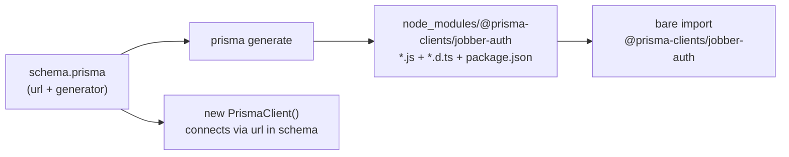
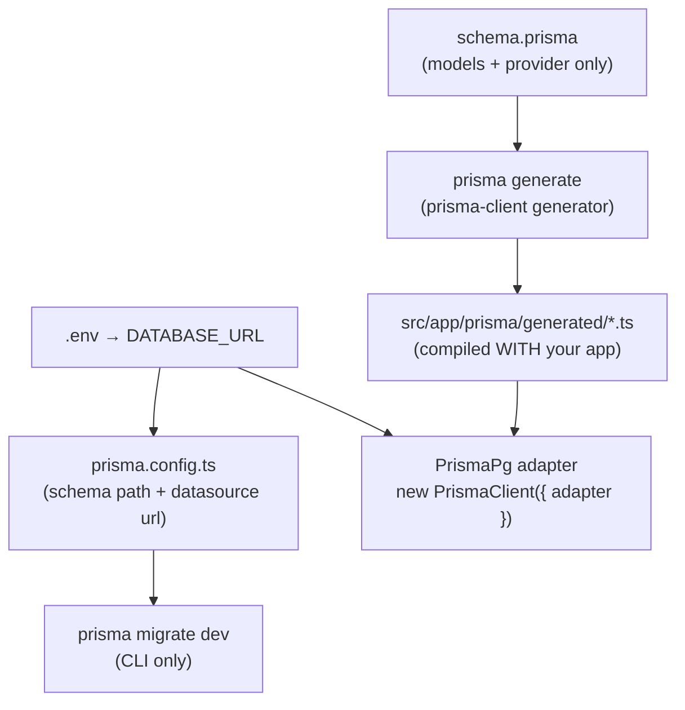
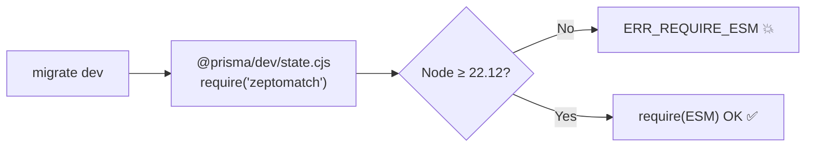
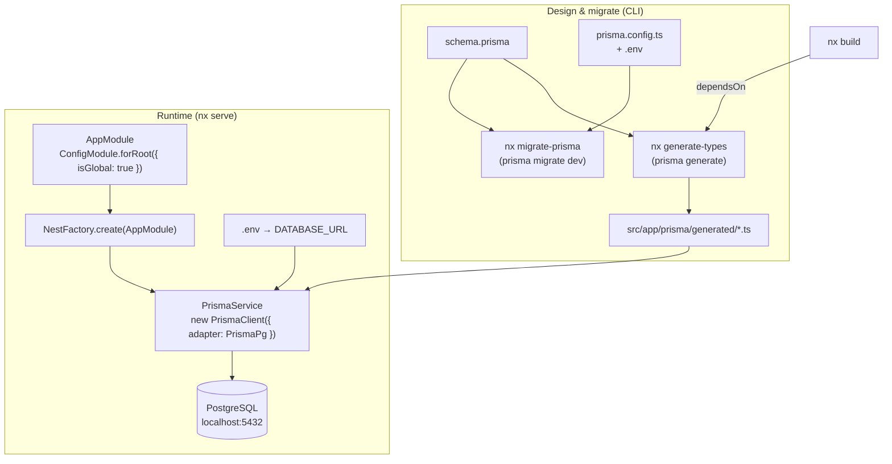

# Prisma 6 → Prisma 7 in this Workspace — Reference & Migration Notes

> Why the Udemy-course code (written for **Prisma 6**) kept breaking on the installed **Prisma 7.9.0**, exactly what changed, how each break was fixed, the TypeScript/module-resolution details, and where the generated client should live.

Related docs: [architecture.md](./architecture.md) · [deployment.md](./deployment.md)

---

## Table of Contents

1. [TL;DR — the five breaking changes](#1-tldr--the-five-breaking-changes)
2. [How Prisma 6 worked (the course's world)](#2-how-prisma-6-worked-the-courses-world)
3. [How Prisma 7 works now](#3-how-prisma-7-works-now)
4. [The breaking changes, one by one](#4-the-breaking-changes-one-by-one)
5. [TypeScript & module-resolution details](#5-typescript--module-resolution-details)
6. [The `prisma/generated` folder — role & where to put it](#6-the-prismagenerated-folder--role--where-to-put-it)
7. [Final state of every touched file](#7-final-state-of-every-touched-file)
8. [End-to-end flow diagram](#8-end-to-end-flow-diagram)
9. [Command & troubleshooting reference](#9-command--troubleshooting-reference)

---

## 1. TL;DR — the five breaking changes

The course targets Prisma 6; this repo installed Prisma **7.9.0**. Prisma 7 is a major release, and each of its breaking changes surfaced in sequence:

| #   | Prisma 6 (course)                                           | Prisma 7 (this repo)                                                      | Fix applied                                                      |
| --- | ----------------------------------------------------------- | ------------------------------------------------------------------------- | ---------------------------------------------------------------- |
| 1   | `url` lives in `schema.prisma` datasource                   | `url` **removed** from schema                                             | Added `prisma.config.ts` holding the URL                         |
| 2   | Prisma auto-loads `.env`                                    | No auto-load                                                              | `process.loadEnvFile()` in the config, `ConfigModule` in the app |
| 3   | `prisma-client-js` → compiled npm package in `node_modules` | `prisma-client` → **raw `.ts` source** meant to be compiled with your app | Output into the source tree + relative import                    |
| 4   | `new PrismaClient()` connects via the schema URL            | A **driver adapter is mandatory** at runtime                              | `@prisma/adapter-pg` passed to `super({ adapter })`              |
| 5   | Runs on Node 18/20                                          | Needs `require(ESM)` → **Node ≥ 22.12**                                   | Upgraded Node; pinned via `.nvmrc` + `engines`                   |

There was also a one-off **syntax typo** (a trailing comma in the generator block) that is not a Prisma-version issue — see [§4.0](#40-not-a-version-issue-the-trailing-comma).

---

## 2. How Prisma 6 worked (the course's world)

Understanding the old model makes every Prisma 7 change obvious.

### Schema owned the connection

```prisma
generator client {
  provider = "prisma-client-js"
  output   = "../../../node_modules/@prisma-clients/jobber-auth"
}

datasource db {
  provider = "postgresql"
  url      = env("DATABASE_URL")   // ← connection URL lived here
}
```

### `prisma generate` emitted a _compiled npm package_

The `prisma-client-js` generator produced **JavaScript + `.d.ts` type declarations + a `package.json`** at the output path. Because it looked like a normal published package inside `node_modules`, a **bare import** resolved with zero configuration:

```ts
import { PrismaClient } from '@prisma-clients/jobber-auth'; // ✅ just works in Prisma 6
```

### Runtime was implicit

- Prisma **auto-loaded `.env`** (both for the CLI and at runtime).
- `new PrismaClient()` read the datasource `url` and connected — no adapter, no driver package.
- `PrismaService extends PrismaClient` + `this.$connect()` was all you needed.



That is exactly what the instructor demonstrates — and none of it holds on Prisma 7.

---

## 3. How Prisma 7 works now

Prisma 7 split responsibilities apart:

- **Schema** describes only _models + which datasource provider_ — **not** the connection URL.
- **`prisma.config.ts`** holds configuration the CLI needs (schema path, datasource URL for Migrate).
- **The generated client is your source code**, not a package: the `prisma-client` generator emits `.ts` files designed to be compiled by _your_ build.
- **Connecting requires a driver adapter** (`@prisma/adapter-pg`, `@prisma/adapter-libsql`, …) constructed from a connection string you supply.



---

## 4. The breaking changes, one by one

### 4.0 (Not a version issue) the trailing comma

The very first error came from a stray comma — the Prisma Schema Language uses **no commas** between fields:

```prisma
provider = "prisma-client-js",   // ❌ breaks the parser; reports "provider missing"
provider = "prisma-client"       // ✅
```

This was a typo, unrelated to Prisma 6 vs 7, but it produced misleading "argument `provider` is missing" noise, so it's worth calling out.

---

### 4.1 `url` removed from the schema datasource

**Error**

```
The datasource property `url` is no longer supported in schema files.
Move connection URLs for Migrate to `prisma.config.ts` ...
```

**Why** — Prisma 7 separates _what the database is_ (schema) from _how to reach it_ (config/adapter).

**Fix** — datasource keeps only the provider; the URL moves to `prisma.config.ts`.

```prisma
datasource db {
  provider = "postgresql"
}
```

```ts
// apps/jobber-auth/prisma.config.ts
import path from 'node:path';
import { defineConfig, env } from 'prisma/config';

process.loadEnvFile(path.join(__dirname, '../../.env')); // see §4.2
export default defineConfig({
  schema: path.join('prisma', 'schema.prisma'),
  datasource: { url: env('DATABASE_URL') }, // required by Migrate
});
```

---

### 4.2 `.env` is no longer auto-loaded

**Why** — Prisma 6 quietly loaded `.env`. Prisma 7 does not, in either the CLI or the app.

**Fix** — load it explicitly in **two** places, because they run in different processes:

- **`prisma.config.ts`** for CLI commands (`generate`, `migrate`), via `process.loadEnvFile()`.
- **`AppModule`** for the running Nest app, via `@nestjs/config` (the adapter gets its URL from `ConfigService`).

```ts
// apps/jobber-auth/src/app/app.module.ts
imports: [ConfigModule.forRoot({ isGlobal: true }), ...];
```

`forRoot()` reads `.env` from `process.cwd()` (the workspace root under `nx serve`) and merges it into `process.env` synchronously, so the values are in place before any provider is constructed. `isGlobal` makes `ConfigService` injectable everywhere without each module importing `ConfigModule`.

> The CLI side still uses `process.loadEnvFile()`, a built-in Node API (no `dotenv` dependency) available on Node ≥ 20.12 / 22, because `prisma.config.ts` runs outside the Nest DI container.

---

### 4.3 The generator changed: `prisma-client-js` → `prisma-client`

**Error (editor)** — `TS2307: Cannot find module '@prisma-clients/jobber-auth'` even though files existed in `node_modules`.

**Why** — the new `prisma-client` generator emits **raw `.ts` ESM source** (with `// @ts-nocheck`, `import.meta.url`, and `.ts`-extension imports), and crucially **no `package.json` and no `index`**. The entry point is `client.ts`. TypeScript can't resolve a _bare_ specifier to a folder that has no package manifest — and code left in `node_modules` is never compiled (tsc excludes `node_modules`), so even the runtime would break.

> Switching the provider back to `prisma-client-js` does **not** help — on Prisma 7 it no longer produces the old compiled package either.

**Fix** — three parts:

1. **Generate into the source tree** and configure the client for a CommonJS NestJS build:

```prisma
generator client {
  provider            = "prisma-client"
  output              = "../src/app/prisma/generated"
  runtime             = "nodejs"
  moduleFormat        = "cjs"   // emits __dirname instead of import.meta.url
  importFileExtension = ""      // extensionless internal imports (./enums, not ./enums.ts)
}
```

2. **Import the generated entry directly** (relative path — no alias needed):

```ts
import { PrismaClient } from './generated/client';
```

3. **Git-ignore** the generated folder (it's rebuilt by the `generate-types` target):

```
apps/*/src/app/prisma/generated
```

Why `moduleFormat = "cjs"` and `importFileExtension = ""` matter: the NestJS app is bundled by webpack with the `tsc` compiler to **CommonJS**. The default generator output uses `import.meta.url` (ESM-only) and `.ts` import extensions, which break a CJS build. These two options make the generated code compile cleanly with the rest of `src/`.

---

### 4.4 A driver adapter is required at runtime

**Error**

```
PrismaClientInitializationError: PrismaClient was instantiated without any options.
A driver adapter is required to connect to your database.
```

**Why** — Prisma 7 no longer connects implicitly from a schema URL. You provide a **driver adapter** built from the connection string.

**Fix** — install `@prisma/adapter-pg` + `pg`, and pass the adapter:

```ts
// prisma.service.ts
import { Injectable, OnModuleInit } from '@nestjs/common';
import { PrismaPg } from '@prisma/adapter-pg';
import { PrismaClient } from './generated/client';

@Injectable()
export class PrismaService extends PrismaClient implements OnModuleInit {
  constructor() {
    super({
      adapter: new PrismaPg({ connectionString: process.env.DATABASE_URL }),
    });
  }
  async onModuleInit() {
    await this.$connect();
  }
}
```

---

### 4.5 Node version: `require(ESM)` is now required

**Error (during `migrate dev`)**

```
Error [ERR_REQUIRE_ESM]: require() of ES Module .../zeptomatch/dist/index.js
from .../@prisma/dev/dist/state.cjs not supported.
```

**Why** — Prisma 7's `@prisma/dev` (used by `migrate dev` for the shadow database) `require()`s an ESM-only dependency. Node can only do that from **v20.19 / v22.12** onward (the `require(ESM)` feature). The repo was on **Node 20.9.0**, too old.

**Fix** — upgrade Node and pin it so it can't regress:

```
# .nvmrc
22
```

```jsonc
// package.json
"engines": { "node": ">=22.12.0" }
```



---

## 5. TypeScript & module-resolution details

### What tsconfig changes were ultimately needed? **None for the import.**

The final approach uses a **relative import** (`./generated/client`), so `tsconfig.base.json` needs no `paths` entry. What _does_ matter is a setting that was already present:

| Setting (in `tsconfig.base.json` / `tsconfig.app.json`) | Why it matters here                                                                                                                                                       |
| ------------------------------------------------------- | ------------------------------------------------------------------------------------------------------------------------------------------------------------------------- |
| `"moduleResolution": "bundler"`                         | Resolves the generated files' **extensionless** relative imports (`./enums`) and lets `./generated/client` resolve to `client.ts`. Pairs with `importFileExtension = ""`. |
| `include: ["src/**/*.ts"]` (app tsconfig)               | Ensures the generated `src/app/prisma/generated/**` is actually compiled with the app.                                                                                    |
| `// @ts-nocheck` (inside generated files)               | Suppresses type-checking of generated code, so `strict`/lint settings don't fail the build.                                                                               |

### The path-alias detour (and why it was dropped)

We briefly wired an alias `@prisma-clients/jobber-auth` in `tsconfig.base.json` to keep the course's bare-import style. Two lessons if you ever want an alias again:

- **`paths` needs relative values when `baseUrl` is unset.** A non-relative value throws `TS5090: Non-relative paths are not allowed when 'baseUrl' is not set`.
- **Do not add `baseUrl` to fix that.** TypeScript `~6.0.3` (this repo) **deprecates `baseUrl`** → `TS5101: Option 'baseUrl' is deprecated and will stop functioning in TypeScript 7.0`.

So a working alias would be `"@prisma-clients/jobber-auth": ["./apps/jobber-auth/src/app/prisma/generated/client"]` (relative value, **no** `baseUrl`). A plain relative import avoids all of this, which is why it's the current choice.

---

## 6. The `prisma/generated` folder — role & where to put it

### What it is

It's the **generated Prisma Client** — TypeScript source (`client.ts`, `models.ts`, `enums.ts`, `internal/…`) produced from `schema.prisma` by `prisma generate`. It gives you the typed `PrismaClient`, the `prisma.user.*` query API, and all model/enum types. On Prisma 7 it is **first-class source code compiled with your app**, not a `node_modules` package.

### Why it currently lives at `apps/jobber-auth/src/app/prisma/generated`

- It is under `src/`, so the app's `tsconfig` (`include: src/**/*.ts`) and the webpack build compile it automatically.
- It sits next to `PrismaService`, so the import is a trivial `./generated/client`.
- It's git-ignored and rebuilt by the `generate-types` target (which `build` depends on), so it never needs to be committed.

### Is that the _best_ place? Options compared

| Location                                                       | Compiles with app? | Import                                  | Verdict                                                                                                                                                             |
| -------------------------------------------------------------- | ------------------ | --------------------------------------- | ------------------------------------------------------------------------------------------------------------------------------------------------------------------- |
| **`src/app/prisma/generated`** (current)                       | ✅ (in `src`)      | `./generated/client`                    | **Fine.** Simple; only nit is that generated code sits inside the hand-written `app/` module folder.                                                                |
| `src/prisma/generated` (sibling of `app/`)                     | ✅                 | `../prisma/generated/client` (or alias) | **Slightly cleaner** separation of generated vs. authored code. Marginal benefit.                                                                                   |
| `src/generated/prisma`                                         | ✅                 | relative / alias                        | Common Prisma-docs convention; equivalent in practice.                                                                                                              |
| **`node_modules/@prisma-clients/...`** (course/Prisma 6 style) | ❌ not compiled    | bare import                             | **Does not work on Prisma 7** — raw `.ts` in `node_modules` is never compiled. This is the original bug.                                                            |
| A shared Nx **library** (`libs/…`)                             | ✅                 | `@jobber/…` alias                       | **Only if multiple apps share one client.** They don't here — each service owns its own database and generates its own client, so a lib adds ceremony for no reuse. |

### Recommendation

**Keep it in the source tree.** On Prisma 7 that's mandatory — it must be compiled with the app. The current `src/app/prisma/generated` is perfectly good. If you want a cleaner split between generated and authored code, move it up one level to `apps/jobber-auth/src/prisma/generated` and update the `output` in `schema.prisma` plus the import. Do **not** move it back into `node_modules`, and don't promote it to a shared `libs/` package unless a second app genuinely needs the _same_ client (unlikely in a database-per-service design).

> If you relocate it, change exactly two things: the generator `output` in `schema.prisma`, and the import path in `prisma.service.ts` (and the `.gitignore` glob if it no longer matches).

---

## 7. Final state of every touched file

**`apps/jobber-auth/prisma/schema.prisma`**

```prisma
generator client {
  provider            = "prisma-client"
  output              = "../src/app/prisma/generated"
  runtime             = "nodejs"
  moduleFormat        = "cjs"
  importFileExtension = ""
}

datasource db {
  provider = "postgresql"
}

model User {
  id       Int    @id @default(autoincrement())
  email    String @unique
  password String
}
```

**`apps/jobber-auth/prisma.config.ts`** — loads root `.env`, supplies datasource URL for Migrate.

**`apps/jobber-auth/src/app/prisma/prisma.service.ts`** — driver adapter + relative import (see §4.4).

**`apps/jobber-auth/src/app/app.module.ts`** — `ConfigModule.forRoot({ isGlobal: true })` loads `.env` for the running app.

**`apps/jobber-auth/project.json`**

- `generate-types` → `prisma generate`
- `migrate-prisma` → `prisma migrate dev --name {args.name}` (default `init`, non-interactive)
- `build` → `dependsOn: ["generate-types"]`

**`tsconfig.base.json`** — no `paths`/`baseUrl` change; relies on existing `moduleResolution: "bundler"`.

**`.gitignore`** — `apps/*/src/app/prisma/generated`.

**`.nvmrc`** = `22`, **`package.json`** → `engines.node >= 22.12.0`, deps `@prisma/adapter-pg`, `pg`, `prisma`/`@prisma/client` `^7.9.0`.

---

## 8. End-to-end flow diagram



---

## 9. Command & troubleshooting reference

```bash
# Always run on Node >= 22.12 first:
nvm use                       # reads .nvmrc → Node 22

# Generate the typed client into src/app/prisma/generated
nx generate-types jobber-auth

# Create/apply a migration (non-interactive; override the name)
nx migrate-prisma jobber-auth --name add_something

# Build (auto-runs generate-types first) and serve
nx build jobber-auth
nx serve jobber-auth          # → http://localhost:3000/api
```

| Symptom                                             | Cause → fix                                                                                   |
| --------------------------------------------------- | --------------------------------------------------------------------------------------------- |
| `ERR_REQUIRE_ESM` in `@prisma/dev`                  | Node too old → `nvm use` (≥ 22.12).                                                           |
| `datasource property url is no longer supported`    | URL in schema → move to `prisma.config.ts`.                                                   |
| `TS2307: Cannot find module '@prisma-clients/...'`  | Client in `node_modules` / no entry → generate into `src`, import `./generated/client`.       |
| `TS5101: 'baseUrl' is deprecated`                   | Don't set `baseUrl` on TS 6 → use a relative import or a relative `paths` value.              |
| `PrismaClient was instantiated without any options` | Missing driver adapter → `new PrismaClient({ adapter: new PrismaPg({ connectionString }) })`. |
| `P1000: Authentication failed`                      | DB user mismatch → align `POSTGRES_USER` in `docker-compose.yml` with `.env`.                 |
| `migrate dev` hangs                                 | Interactive name prompt → the target passes `--name` (default `init`).                        |

```

```
